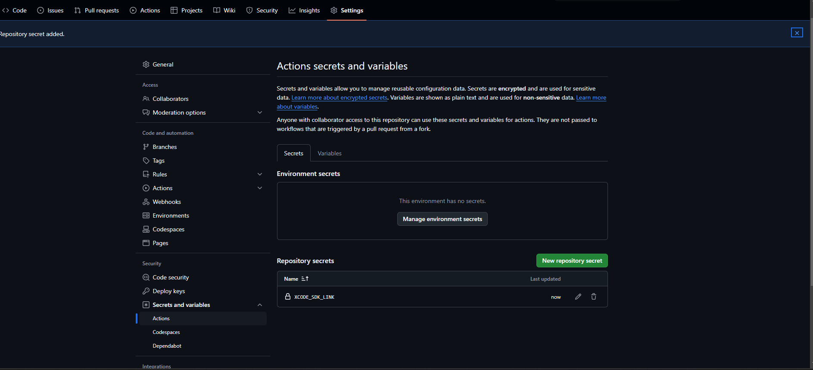

When setting up a GitHub Self-Hosted Runner, remember to install it as a service and run it as root. Just create the runner as usual, but in the `Configure` part, use this command instead: 

```
sudo ./svc.sh install root

sudo ./svc.sh start
```


# Setting Up macOS Container with Xcode SDK

To prepare your macOS container, you need to install the [Xcode SDK](https://developer.apple.com/services-account/download?path=/Developer_Tools/Xcode_15.4/Xcode_15.4.xip) (we are currently using version 15.4). For more information, refer to this [StackOverflow answer](https://stackoverflow.com/a/10335943/12234661).

## Downloading and Hosting the Xcode SDK

Once you've downloaded the Xcode SDK, it should be named exactly `Xcode_15.4.xip`. Next, you’ll need to host this file online so that the GitHub Actions workflow can access it. Here, we’ll use Google Drive for this purpose.

### Step 1: Upload the File to Google Drive

1. Upload the `Xcode_15.4.xip` file to your Google Drive.
2. Make the file shareable by creating a link that allows anyone with the link to access it. For GitHub Actions, you'll need a direct download link.

### Step 2: Obtain the Direct Download Link

[StackOverflow answer](https://stackoverflow.com/a/63781195/12234661)

1. Get the file ID from the shareable link, which typically looks like this:
   ```
   https://drive.google.com/file/d/FILE_ID/view?usp=sharing
   ```
   Here, `FILE_ID` is what you need.

### Step 3: Set Up GitHub Secrets

1. Go to your GitHub repository.
2. Navigate to **Settings** > **Secrets and variables** > **Actions** > **New repository secret**.
3. Add a secret called `XCODE_SDK_LINK` and set its value to your `FILE_ID`.



### Important Considerations

- Be aware of Google Drive’s size limits for file downloads. If the file is too large, you may need to implement a confirmation step, as Google Drive may block large downloads.
- Ensure that the file's permissions are set to allow anyone with the link to download it.

By following these steps, you’ll enable seamless access to the Xcode `.xip` file during your GitHub Actions workflow.